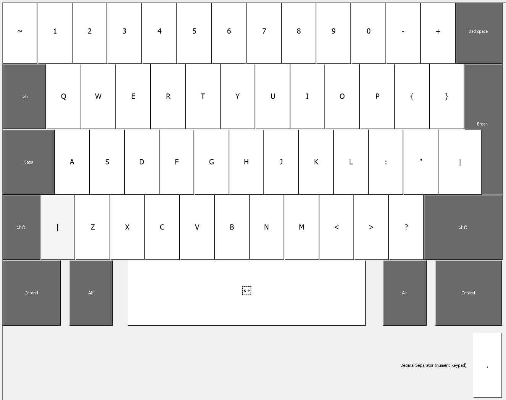
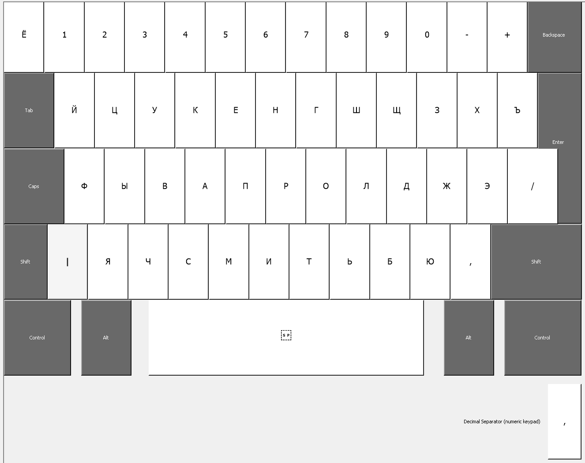

# OmniKeys
Keyboard Layout with Numpad

Special characters are on main keyboard, Numbers are on Numpad.

Use OmniKeys Keyboard Layout only with Numpad.

#### Build

Use [Microsoft Keyboard Layout Creator](https://www.microsoft.com/en-us/download/details.aspx?id=102134) for KLC files and build setup package.

#### Installation

Download setup archive, unzip it and install with setup.exe.

_For Windows 10_ Go to `Parameters => Date and Language => Language`, then `Preferred Languages => English  _or_ Russian => Settings`, after that `Add Keyboard` OmniKeys. You may delete primary keyboard.

#### Using

**OmniKeysEn** - Keyboard Layout for US English Language.

_Primary Keyboard Layout_

_Shift Keyboard Layout_

**OmniKeysRu** - Keyboard Layout for Russion Language.

_Primary Keyboard Layout_

_Shift Keyboard Layout_

